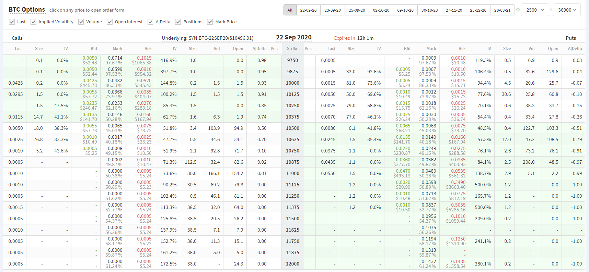

# Deribit Data Pulling

## Introduction

A simple website can help users to identify timeframes they want and pulling market data directly from Deribit exchange API (v2). 

Plotly is used with gunicorn for async support.

All public requests are free to use, and one needs to be authorized using `public/auth` in order to make private requests, most of 
 requests for account management and trades are private.

multiple timeframes, including 1, 3, 5, 10, 15, 30 min, 1, 2, 3, 6, 12 hr and 1 day are supported. 

BTC and ETH are the only 2 cryptocurrency in the Deribit exchange, and their options and futures are both available.

## Follow This to Reproduce the Website Sheet

you must see this in the Deribit.com, and if you want to reproduce the data sheet like this, please follow these steps.
 

-- currently working on 

## Current Limits on API

Current limits:

* Matching engine requests - 5/s (20 in burst)
* Other requests - 30/s (400 in burst)

## Ticker 

the `public/ticker` is a real-time request that can be made multiple times, so you can use the ticker method instead of main,
run 

`python ticker.py`

to start recording for ticker data every 3 seconds. Data will be downloaded into the `Data/ticker` folder
